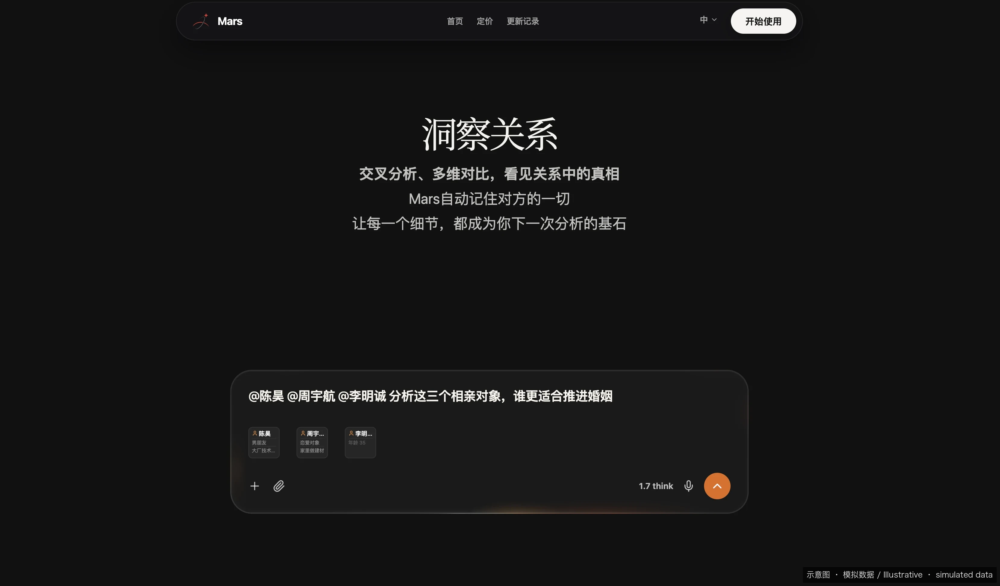

# Mention a person right inside the chat.

> Canonical source of record: [https://marsdata.ai/changelog](https://marsdata.ai/changelog)
> Release `0.1.1.2383` · 2026-07-24

*Illustrative mock-up · demo data, private fields masked with *, not real user information*

- **New** — You can now @-mention a person directly in chat — type @ and the picker opens on your Relationships by default, so you can pull someone you've already told Mars about straight into your message. Their key details ride along automatically.
- **New** — Upload a screenshot of a chat and Mars reads the conversation style, then offers to save a personalized reply coach for that exact person — one tap turns it into a reusable skill you can call anytime with /.
- **Improved** — After you save a reply coach, Mars now confirms it back to you — what got saved, that it'll recognize this person next time, and how to invoke it — so you're never left guessing whether the save actually worked.
- **New** — @-mention someone and Mars shows a rich relationship card right inside your message — their recent facts, latest interactions, and a short profile excerpt — instead of a plain name tag.

---

[Back to all releases](../README.md) · [Try Marsdata AI](https://marsdata.ai) · [简体中文](./2026-07-24-mention-a-person-right-inside-the-chat.zh-CN.md) · [繁體中文](./2026-07-24-mention-a-person-right-inside-the-chat.zh-HK.md)
