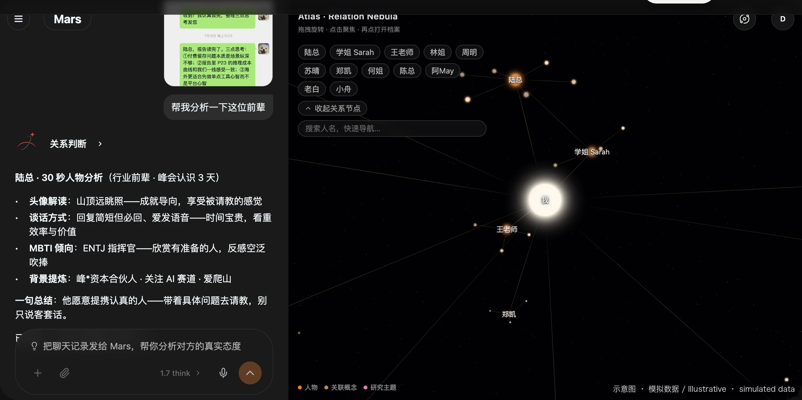

# 让 Mars 帮你整理 Atlas，并重新连好每一个关系圈层。

> 内容以官网为准：[https://marsdata.ai/changelog](https://marsdata.ai/changelog)
> 版本 `0.1.1.2922` · 2026-08-15

*示意图 · 演示数据，隐私字段已用 * 遮挡，非真实用户信息*

- **新功能** — 你现在可以直接让 Mars 帮你整理 Atlas——把某个人移到正确圈层、置顶或隐藏人物、调整圈层的突出程度，以及确认或忽略一段关系，不再需要手动改档案。
- **改进** — Atlas 现在会依据完整的人物名册来组织关系圈层。无论一个人来自结构化档案还是关系历史，都能参与归类；当其中一处资料不完整时，恢复回来的联系人也会重新回到所属圈层，而不是一直停留在未关联状态。
- **改进** — 关系圈层现在更容易浏览和定位。每一行都有清晰的颜色标记，收起圈层列表时搜索框宽度保持稳定，预览也会使用与 Atlas 本身一致的关系视图。

---

[返回全部更新](../README.zh-CN.md) · [开始使用 Marsdata AI](https://marsdata.ai) · [English](./2026-08-15-ask-mars-to-curate-your-atlas-and-reconnect.md) · [繁體中文](./2026-08-15-ask-mars-to-curate-your-atlas-and-reconnect.zh-HK.md)
